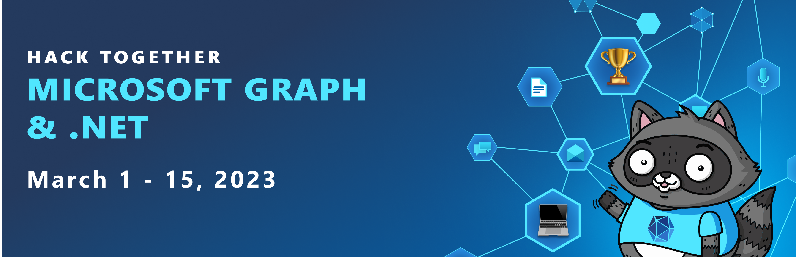
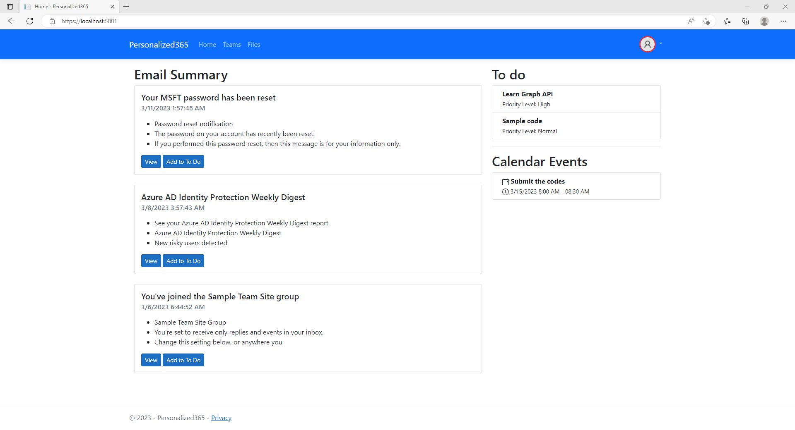
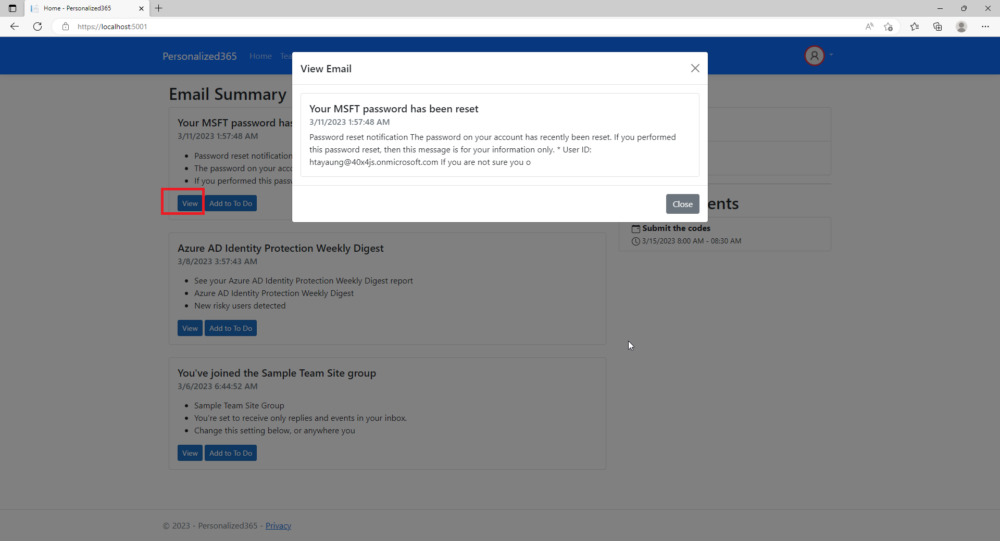
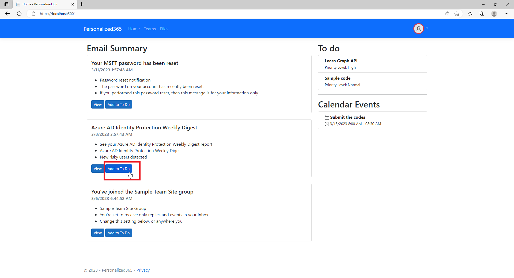
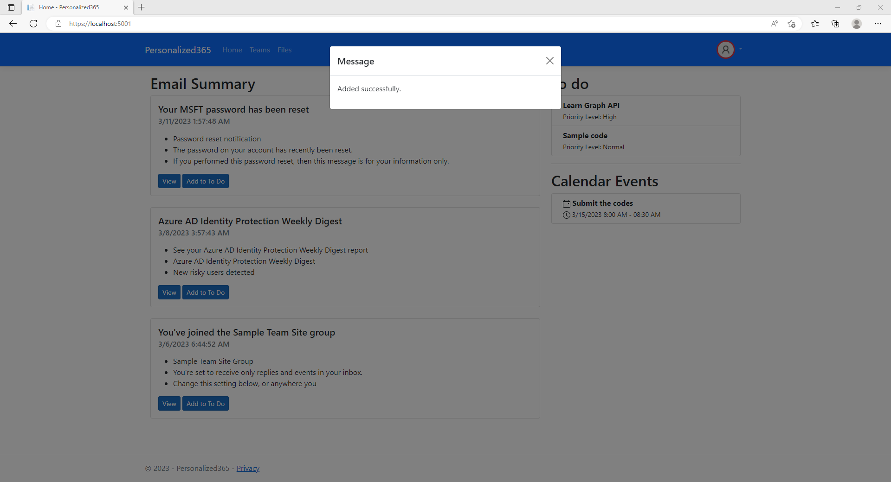
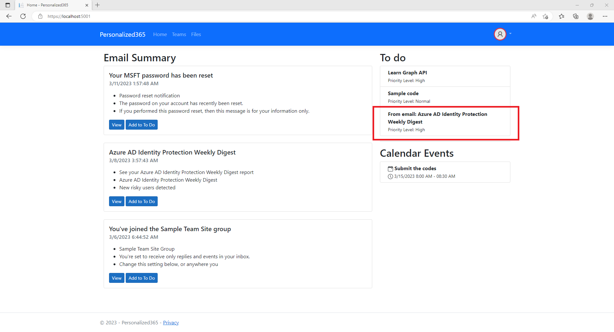
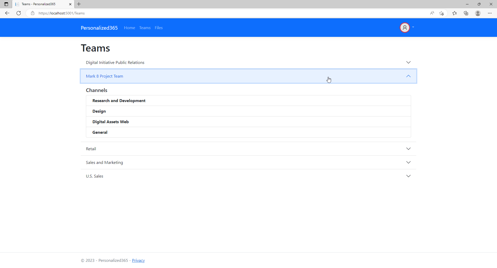
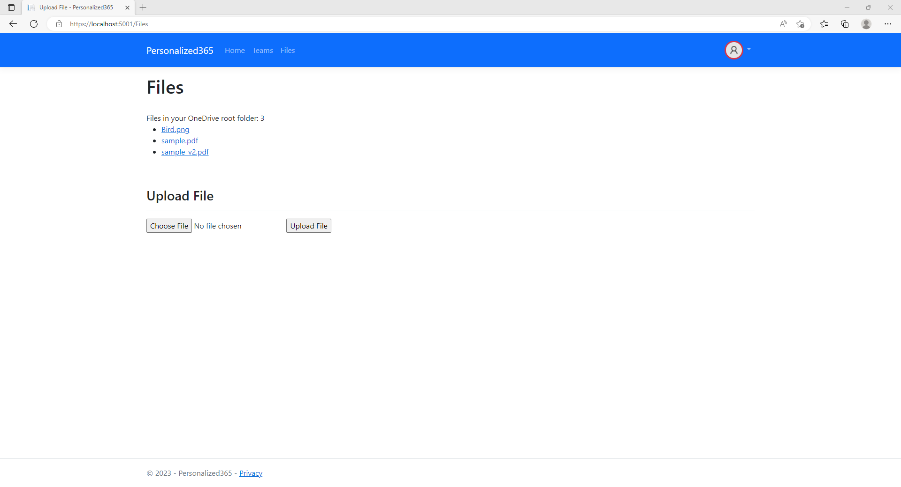
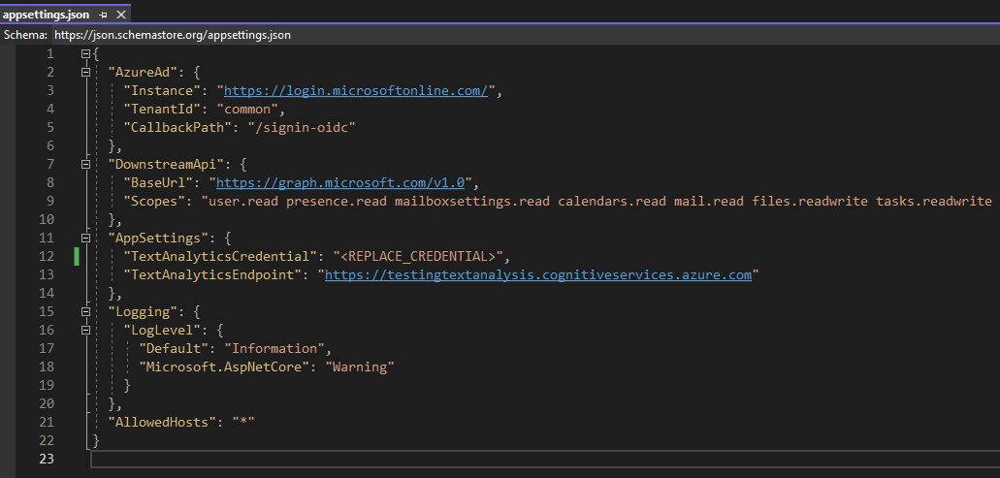

# Personalized365

  

## Background
This is a simple web application that displays email summary, todo list, calendar events, joined teams information. So, user can access frequently used services easily.

## Technologies used
* .NET 7
* ASP.NET Core Web App
* Microsoft Graph .NET Client Library
* Azure.AI.TextAnalytics

## Screenshots

  
  
  
  
  
  
  

## Configuration
